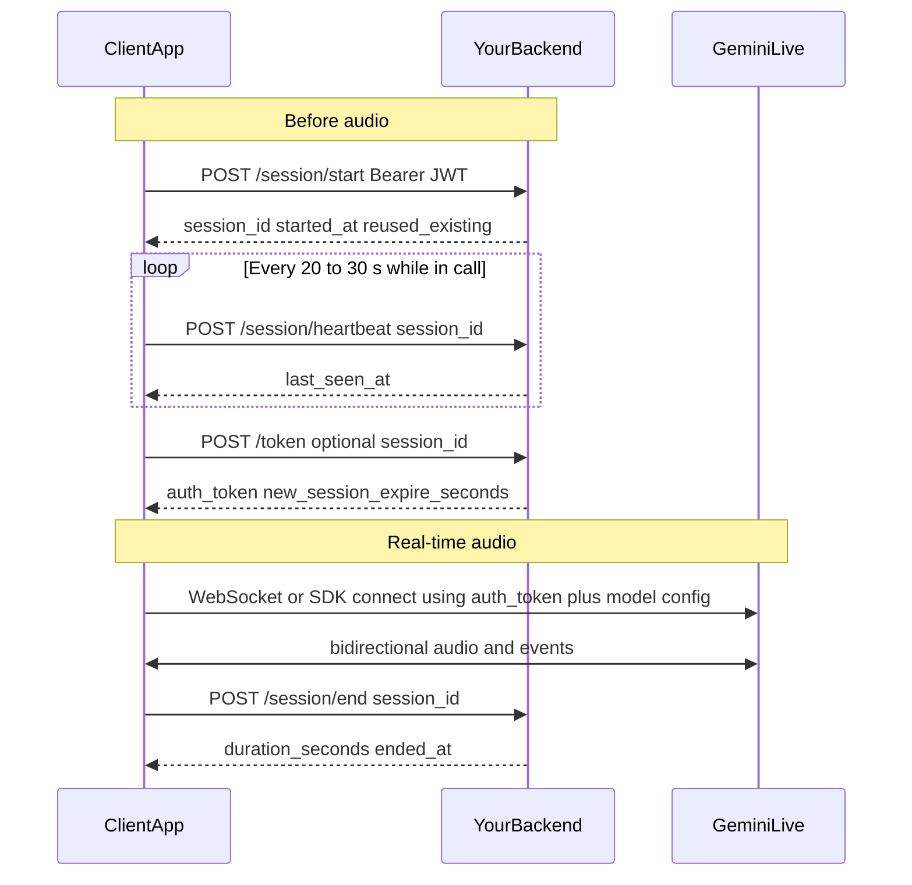

# Frontend integration guide: Gemini Live (real-time voice)

This document explains how a **client app** (web, React Native, Flutter, etc.) integrates with the backend **Gemini Live control plane** and with **Google’s Gemini Live API** for real-time voice.

**Important architecture rule:** Your FastAPI backend does **not** stream audio. The client opens a **WebSocket (or SDK connection) directly to Google** for the Live session. The backend provides **authentication**, **subscription checks**, **prompt/model configuration**, **ephemeral auth tokens**, **session bookkeeping**, and **usage accounting**.

All HTTP routes in this guide use the prefix **`/api/v1/ai/live`**. Replace the host with yours (e.g. `https://api.example.com`, `http://localhost:8000`).

**Related docs**

- Backend overview and env vars: [GEMINI_LIVE.md](./GEMINI_LIVE.md)
- JWT and onboarding: [FRONTEND_AUTH_INTEGRATION.md](./FRONTEND_AUTH_INTEGRATION.md)
- Official Google Live API: [Gemini Live API](https://ai.google.dev/gemini-api/docs/live), [Ephemeral tokens](https://ai.google.dev/gemini-api/docs/ephemeral-tokens), [WebSockets API reference](https://ai.google.dev/api/live)
- Example flows (Google): [gemini-live-api-examples](https://github.com/google-gemini/gemini-live-api-examples) (includes ephemeral token + WebSocket patterns)

---

## 1. Prerequisites

### 1.1 Authentication

Every Live HTTP endpoint requires:

| Header | Value |
|--------|--------|
| `Authorization` | `Bearer <access_token>` |

Use the same **short-lived access JWT** as the rest of the app. Refresh it using your existing **`POST /api/v1/auth/refresh`** flow before it expires (see the auth integration guide).

### 1.2 Onboarding

If `onboarding_completed` is **false**, Live endpoints return **403** with detail similar to:

`User onboarding not completed`

The client should route the user to the onboarding flow before offering Gemini Live.

### 1.3 Subscription and usage

Live routes use the same dependency chain as other AI features:

- **`require_active_plan`** — Free users who exceed daily **chat** or **voice** limits receive **402** with a JSON body (same shape as other subscription-gated routes; your global handler may surface `error` / `message` at the top level for 402).
- **`require_gemini_live_plan`** — If the server is configured with a **minimum plan** (`GEMINI_LIVE_MIN_PLAN`) higher than the user’s effective plan, the API returns **403** with a plain string `detail` (not the structured 402 shape).

### 1.4 What you need on the client for Google Live

- A **Google AI / Gemini Live capable client** for your platform: official **JavaScript** (`@google/genai` or documented Live client), **iOS**, **Android**, etc., as per [Google’s Live documentation](https://ai.google.dev/gemini-api/docs/live).
- The backend returns an **`auth_token`** string from **`POST /live/token`**. That value is an **ephemeral token identifier** minted server-side; pass it into the Live client **exactly as your chosen SDK or WebSocket guide specifies** (do not embed the raw `GEMINI_API_KEY` in the app).

---

## 2. Architecture overview



- **Your backend** never receives raw microphone streams for Live in this design.
- **Heartbeats** keep the server-side `live_sessions` row “fresh” so a background **reaper** does not auto-close the session and bill usage incorrectly.
- **`POST /token`** is **rate-limited per user** in Redis when Redis is available; expect **429** with a structured body (see section 7).

---

## 3. Endpoint reference

Unless noted, responses are **JSON** with `Content-Type: application/json`. Errors may use either a JSON object `detail` wrapper from FastAPI (`{"detail": "..."}`) or a **top-level JSON object** for special statuses (402, 410, 429) as described below.

### 3.1 `GET /api/v1/ai/live/config`

**Purpose:** Fetch **safe** Live configuration for UI, logging, or aligning with what the user will experience. This response **never** includes your Gemini API key.

**Query parameters**

| Name | Required | Description |
|------|----------|-------------|
| `conversation_id` | No | If set, must be a **conversation owned by the user**. Injects that conversation’s `long_term_context` into the generated `system_instruction`. |

**Success (200)** — body shape:

| Field | Type | Description |
|-------|------|-------------|
| `model` | string | Model id to use in Live `setup` (matches server env). |
| `system_instruction` | string | Full system instruction text (persona + optional learner profile + optional long-term context). |
| `prompt_version` | string | Server template version (for support logs / cache keys). |
| `voice` | string or null | Prebuilt voice name hint (e.g. for native audio). |
| `language_code` | string or null | BCP-47 hint for your UI or client-only setup (server does not put this in Live `speech_config`). |
| `temperature` | number | Suggested generation temperature. |
| `response_modalities` | string[] | e.g. `["AUDIO"]` |

**Typical errors**

| Status | When |
|--------|------|
| 401 | Missing or invalid JWT |
| 403 | Onboarding incomplete, or Live not allowed for plan |
| 402 | Free tier daily limits exceeded |
| 404 | `conversation_id` set but not found for this user |

---

### 3.2 `GET /api/v1/ai/live/session/active`

**Purpose:** Discover whether the user already has an **open** Live session (single active session per user). Use after app resume, tab refresh, or before starting UI.

**Success (200)** — no active session:

```json
{ "active": false }
```

**Success (200)** — active session:

```json
{
  "active": true,
  "session_id": "<uuid>",
  "started_at": "<ISO-8601 Z>",
  "last_seen_at": "<ISO-8601 Z>",
  "conversation_id": "<uuid-or-null>"
}
```

**Typical errors:** same auth/onboarding/subscription pattern as `/config`.

---

### 3.3 `POST /api/v1/ai/live/session/start`

**Purpose:** Open a **server-tracked** Live session (metadata only). **At most one active session per user:** if an open session already exists, the same `session_id` is returned with `reused_existing: true` (multi-tab safe).

**Headers:** `Authorization: Bearer <token>`  
**Body (JSON):**

```json
{
  "conversation_id": "<optional-uuid>",
  "client_platform": "<optional e.g. ios web>"
}
```

Both fields are optional. If `conversation_id` is present, it must belong to the user (same rules as `/config`).

**Success (200)**

```json
{
  "session_id": "<uuid>",
  "started_at": "<ISO-8601 Z>",
  "reused_existing": false
}
```

`reused_existing` is **`true`** when the server reused an existing open session instead of inserting a new row.

**Typical errors:** 401, 402, 403, 404 (invalid conversation).

---

### 3.4 `POST /api/v1/ai/live/session/heartbeat`

**Purpose:** Update **`last_seen_at`** so the server does not treat the session as abandoned. Call on an interval while the user is in a Live call (recommended **every 20–30 seconds**). Also call on **app foreground** if you pause heartbeats in background.

**Body (JSON):**

```json
{ "session_id": "<uuid>" }
```

**Success (200)**

```json
{
  "session_id": "<uuid>",
  "last_seen_at": "<ISO-8601 Z>"
}
```

**Typical errors**

| Status | When |
|--------|------|
| 404 | Unknown `session_id`, wrong user, or session already ended |
| 401 / 402 / 403 | Same as other Live routes |

---

### 3.5 `POST /api/v1/ai/live/session/end`

**Purpose:** Close the server session and record **usage** (daily `minutes_used` + one **`voice_count`** increment for a completed session). **Idempotent:** if the session is already closed, you still get **200** with the **stored** `duration_seconds` and `ended_at` (no double charge).

**Body (JSON):**

```json
{ "session_id": "<uuid>" }
```

**Success (200)**

```json
{
  "session_id": "<uuid>",
  "duration_seconds": 123.45,
  "ended_at": "<ISO-8601 Z>"
}
```

**Typical errors**

| Status | When |
|--------|------|
| 404 | Session not found for this user |
| 401 / 402 / 403 | Auth / plan |

Call **`/session/end`** from:

- Explicit “End call” UI
- `pagehide` / `beforeunload` (web, best-effort)
- App lifecycle `onDestroy` / background kill (mobile, best-effort)

If the client never calls `end`, the server **reaper** may auto-close stale sessions after a configured heartbeat timeout; usage is still finalized once.

---

### 3.6 `POST /api/v1/ai/live/token`

**Purpose:** Mint a **short-lived ephemeral auth token** for the client to open a **direct** Live connection to Google. This is the **bridge** that keeps the API key off the device.

**Body (JSON):**

```json
{ "session_id": "<optional-uuid>" }
```

- **`session_id` omitted:** Token is minted with the same **global** system instruction as `/config` **without** conversation-bound context (unless you only passed context via `/config` for display — for token parity with a specific conversation, pass `session_id` from a session started with that `conversation_id`).
- **`session_id` present:** Must refer to an **open** session owned by the user. The server rejects ended or **heartbeat-stale** sessions (see 410 below).

**Success (200)**

```json
{
  "auth_token": "<opaque-token-resource-name>",
  "new_session_expire_seconds": 120
}
```

- **`auth_token`:** Pass into your Live client per [Ephemeral tokens](https://ai.google.dev/gemini-api/docs/ephemeral-tokens) and your SDK version.
- **`new_session_expire_seconds`:** Hint from the server for how long new Live sessions may typically be started with this token; align UX (e.g. “connect within 2 minutes”) with this value.

**Typical errors**

| Status | Body / notes |
|--------|----------------|
| 401 | Unauthorized |
| 402 | Subscription / daily limits |
| 403 | Onboarding or minimum plan |
| **429** | **Rate limited** — JSON body is **top-level** `{ "type": "RATE_LIMITED", "message": "..." }` (not wrapped in `detail`) when using the app’s HTTPException handler for this case. Back off and retry after a short delay. |
| **410** | Session unusable — JSON body **top-level** `{ "type": "SESSION_ENDED" \| "SESSION_STALE", "message": "..." }`. Start a new session with `POST /session/start` and refresh heartbeats. |
| 503 | e.g. missing `GEMINI_API_KEY` on server, or **prod** without Redis when `GEMINI_LIVE_REDIS_REQUIRED_FOR_TOKEN` requires Redis for rate limiting |
| 502 | Token mint failed upstream |

---

## 4. Recommended client flow (step by step)

### 4.1 Cold start

1. Ensure the user is **logged in** and **onboarding complete**.
2. Optionally **`GET /api/v1/ai/live/config?conversation_id=...`** to show model / language in settings or debug.
3. **`GET /api/v1/ai/live/session/active`**  
   - If `active: true`, reuse `session_id` for heartbeat + token (skip start or call start anyway — start will return `reused_existing: true`).
4. If no active session: **`POST /api/v1/ai/live/session/start`** with optional `conversation_id` / `client_platform`. Store **`session_id`**.

### 4.2 Before connecting to Google

5. Start a **heartbeat timer** (interval **20–30 s**): **`POST /api/v1/ai/live/session/heartbeat`** with `{ "session_id" }`. Stop the timer when the Live call ends or errors fatally.
6. **`POST /api/v1/ai/live/token`** with `{ "session_id" }` (recommended so token aligns with session + conversation context). Handle **429** (backoff) and **410** (restart session flow).

### 4.3 Connect to Gemini Live (client-side)

7. Use **Google’s official documentation** for your stack to:
   - Build the **LiveConnect** / WebSocket `setup` using at least:
     - `model` from `/config` (should match server; still read from `/config` for truth),
     - `system_instruction` from `/config` **or** ensure it matches what the server locked into the token (when using `session_id` on `/token`, the server builds instruction consistently with that session’s `conversation_id`).
   - Pass **`auth_token`** where the SDK or raw WebSocket flow expects the ephemeral credential.

**Transcription:** Tokens are minted with **input** and **output** audio transcription enabled in the locked Live config. Subscribe to the Live message types Google documents for user and model transcript deltas (do not override transcription off in client `setup` if your SDK merges config with the token in a way that would drop server constraints).

**Note:** Field names for `setup` (e.g. `systemInstruction`, `speechConfig`, `responseModalities`) follow **Google’s** schema, not your backend’s JSON names. Map from `/config` into that schema.

### 4.4 During the call

8. Keep sending **heartbeats** on the interval while the Live connection is active.
9. Handle Google disconnects: if the user intends to continue later, either keep the session open (heartbeats) or **`POST /session/end`** to free quota; if they reconnect quickly, **`/session/active`** may still show an open session until ended or reaped.

### 4.5 Teardown

10. Close the Google Live connection per SDK.
11. **`POST /api/v1/ai/live/session/end`** with `session_id` (safe to **retry** on network failure — idempotent).
12. Clear local state: timers, `session_id`, cached `auth_token`.

---

## 5. Multi-tab and resume behavior

- **Single active session per user:** A second tab calling **`/session/start`** receives the **same** `session_id` with **`reused_existing: true`**.
- **Heartbeats** from any tab update **`last_seen_at`** for that session.
- **Ending** the session from one tab closes it for all tabs; other tabs should treat **404** on heartbeat as “session gone” and reset UI.

---

## 6. Error handling checklist (client)

| HTTP | Action |
|------|--------|
| **401** | Refresh token or redirect to login |
| **402** | Show upgrade / limit UI; do not retry blindly |
| **403** | Onboarding or plan: show appropriate screen |
| **404** | Bad `session_id` or conversation; reset session state |
| **410** | Re-run **start → heartbeat → token** |
| **429** | Exponential backoff on `/token`; avoid tight loops |
| **502 / 503** | Show generic failure; retry with backoff if appropriate |

Parse **JSON** bodies for 410 and 429 when `Content-Type` is JSON; some other errors may still be `{ "detail": "..." }`.

---

## 7. Rate limiting (`POST /token`)

When Redis is available, the backend enforces a **per-user** limit on token mints (default: a small number per rolling minute; see server env `GEMINI_LIVE_TOKEN_REQUESTS_PER_MINUTE` and `GEMINI_LIVE_TOKEN_RATE_WINDOW_SECONDS` in [GEMINI_LIVE.md](./GEMINI_LIVE.md)).

**Client guidance**

- Do **not** call `/token` on every UI frame or heartbeat tick. Call it **once** (or again only after a **410** / reconnect path).
- On **429**, read `type: RATE_LIMITED` and show a calm message; retry after several seconds at minimum.

---

## 8. Security checklist

- Never ship **`GEMINI_API_KEY`** (or any long-lived Google key) in the mobile app or browser bundle.
- Store **`access_token`** and **`refresh_token`** using your platform’s secure storage.
- Treat **`auth_token`** from `/live/token` as **short-lived**; do not log it in analytics in production.

---

## 9. Minimal TypeScript types (optional)

You can mirror the API in TypeScript for type safety:

```ts
export type LiveConfigResponse = {
  model: string;
  system_instruction: string;
  prompt_version: string;
  voice: string | null;
  language_code: string | null;
  temperature: number;
  response_modalities: string[];
};

export type LiveSessionStartResponse = {
  session_id: string;
  started_at: string;
  reused_existing: boolean;
};

export type LiveTokenResponse = {
  auth_token: string;
  new_session_expire_seconds: number;
};

export type RateLimitedBody = { type: "RATE_LIMITED"; message: string };
export type SessionGoneBody = {
  type: "SESSION_ENDED" | "SESSION_STALE";
  message: string;
};
```

Use `fetch` or your HTTP client with `credentials` / auth headers as appropriate for your app.

---

## 10. Testing against local backend

1. Run the backend (e.g. `uvicorn app.main:app --reload`).
2. Obtain a real **access token** (OAuth flow or test helper).
3. Call **`GET /api/v1/ai/live/config`** with `Authorization: Bearer ...`.
4. Walk through **start → heartbeat → token**; then integrate the Google client using the official Live quickstart for your platform.

If **`POST /token`** returns **503** about Redis in production, ensure Redis is reachable from the API process and that `GEMINI_LIVE_REDIS_REQUIRED_FOR_TOKEN` matches your ops policy.

---

## 11. Changelog awareness

Server may add optional fields to JSON responses without breaking clients that ignore unknown keys. **`prompt_version`** and **`reused_existing`** are examples clients can log for diagnostics.

When the server bumps **`GEMINI_LIVE_PROMPT_VERSION`**, you may see different `system_instruction` text for the same user; no client change is strictly required unless you cache instructions client-side (prefer not to cache across sessions without invalidation).
