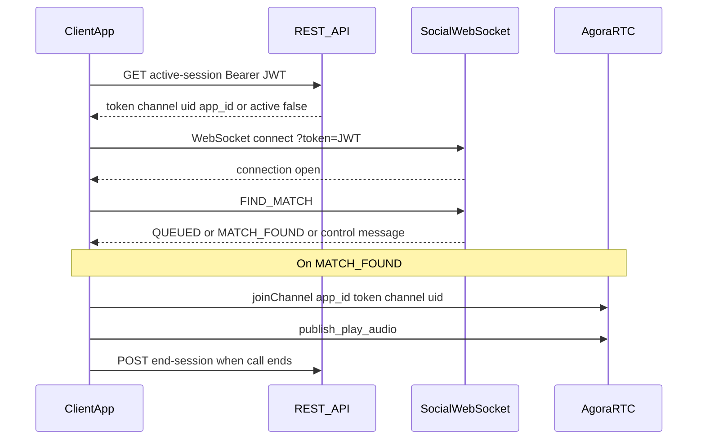

# Frontend integration guide: Social voice matchmaking

This document describes how a client (web, React Native, Flutter, etc.) integrates with the backend **social voice matchmaking** feature: **WebSocket** signaling, **REST** helpers, and **Agora Voice SDK** for the actual audio call.

All HTTP routes are under the API prefix **`/api/v1/social`**. Adjust the host (e.g. `https://api.example.com`) for your environment.

---

## Prerequisites

1. **Access token** — Same JWT **access** token used for other authenticated APIs (`Authorization: Bearer <token>` on HTTP).
2. **Onboarding** — User must have completed onboarding (`onboarding_completed` on the user record). Otherwise the WebSocket closes after an error payload.
3. **Subscription / usage** — Same rules as other voice features: `require_active_plan` applies. Free users within daily limits may use social matchmaking; if over limit, HTTP **402** (REST) or WebSocket **ERROR** with `subscription_required` applies.
4. **Agora** — The app must embed the **Agora Voice / RTC SDK** for your platform. The backend only issues **channel name**, **token**, **uid**, and **app_id**; the client joins the channel locally.

---

## Architecture overview



- **Matchmaking** is driven only through the **WebSocket** (no polling).
- **Voice media** goes **peer-to-peer / SFU via Agora**, not through your FastAPI server.

---

## REST endpoints

### `GET /api/v1/social/active-session`

**Purpose:** Reconnect or cold start: discover whether the user is already in an **active** social session and obtain a **fresh** Agora token.

**Headers**

| Header           | Value                    |
|------------------|--------------------------|
| `Authorization`  | `Bearer <access_token>`  |

**Success — no active session (200)**

```json
{ "active": false }
```

**Success — active session (200)**

```json
{
  "active": true,
  "session_id": "uuid-string",
  "channel": "session_<uuid>",
  "token": "<agora-rtc-token>",
  "uid": 123456789,
  "app_id": "<your-agora-app-id>"
}
```

**Errors**

| Status | When |
|--------|------|
| 401    | Missing or invalid JWT |
| 402    | Subscription / usage gate (same body shape as other subscription errors when applicable) |
| 503    | Agora token could not be generated (e.g. server misconfiguration) |

**Client usage**

- Call this when the app opens the “social / random match” screen, or after network recovery, **before** or **in parallel** with opening the WebSocket.
- If `active: true`, join Agora with the returned `app_id`, `token`, `channel`, and **`uid` exactly as returned**. Do not invent a random uid for reconnect; the server’s uid is tied to token generation.

---

### `POST /api/v1/social/end-session`

**Purpose:** Mark the DB session as ended and record usage for the **current user** (minutes + voice count).

**Headers**

| Header           | Value                    |
|------------------|--------------------------|
| `Authorization`  | `Bearer <access_token>`  |
| `Content-Type`   | `application/json`       |

**Body**

```json
{ "session_id": "<uuid-from-MATCH_FOUND-or-active-session>" }
```

**Success (200)**

```json
{ "success": true }
```

**Errors**

| Status | When |
|--------|------|
| 404    | Unknown `session_id` |
| 403    | Authenticated user is not `user1` or `user2` on that session |

Ending an already-ended session is idempotent: you still get `{ "success": true }` without double-counting usage.

**Client usage**

- Call when the user leaves the call UI, or when the Agora `onLeaveChannel` / teardown runs.
- Both peers may call `end-session`; usage is updated **per caller** (current implementation).

---

## WebSocket: `GET ws(s)://<host>/api/v1/social/ws`

Browsers and many mobile WebSocket APIs **do not** send custom headers. Auth is passed as a **query parameter**.

### Connection URL

```
wss://<api-host>/api/v1/social/ws?token=<URL_ENCODED_ACCESS_JWT>
```

- Use **`wss://`** in production (TLS).
- **URL-encode** the JWT (e.g. `encodeURIComponent(accessToken)` in JavaScript).

### Connection lifecycle

1. Server validates JWT and loads the user.
2. Server **accepts** the socket, then may send **one** JSON error and **close** if:
   - onboarding incomplete,
   - subscription check fails (e.g. free tier over limit),
   - Redis is unavailable (`redis_unavailable`, close code **1011**).
3. If successful, the connection stays open for **`PING`** / **`FIND_MATCH`** and incoming events.

### Close codes (reference)

| Code  | Typical reason (from server)        |
|-------|-------------------------------------|
| 1008  | Policy violation: bad/missing token, onboarding, subscription, etc. |
| 1011  | Internal / Redis unavailable        |

Always read the last JSON **ERROR** message before close when present.

---

## WebSocket messages: client → server

Send **JSON objects** with a `type` field.

### `PING` (keepalive)

```json
{ "type": "PING" }
```

**Server response**

```json
{ "type": "PONG" }
```

Use a timer (e.g. every 20–30 seconds) while the matchmaking screen is open to detect half-open connections.

---

### `FIND_MATCH` (join queue / trigger pairing)

```json
{ "type": "FIND_MATCH" }
```

**Important:** Each send is one “matchmaking attempt” for rate limiting. Do not spam; debounce UI (e.g. single active “Find partner” action).

---

## WebSocket messages: server → client

### `QUEUED`

You are enqueued; no partner was available in this round. **Another user** (or the same user after waiting) must also request `FIND_MATCH` for a pair to form.

```json
{ "type": "QUEUED" }
```

**UI:** Show “Searching…” and optionally allow cancel (disconnect WebSocket or navigate away clears server-side queue state for that connection’s cleanup path).

---

### `MATCH_FOUND`

A session was created and tokens were delivered to **both** peers.

```json
{
  "type": "MATCH_FOUND",
  "session_id": "uuid",
  "channel": "session_<uuid>",
  "token": "<agora-rtc-token>",
  "uid": 123456789,
  "peer_user_id": "<other-user-uuid>",
  "app_id": "<agora-app-id>"
}
```

| Field            | Meaning |
|------------------|--------|
| `session_id`     | Persist for `end-session` and support. |
| `channel`        | Agora channel name — both users join the **same** channel. |
| `token`          | Short-lived RTC token; refresh via `active-session` if user reconnects. |
| `uid`            | **Integer** Agora UID — pass **exactly** this into `joinChannel`. |
| `peer_user_id`   | Opponent’s app user id (for UI: “Partner: …”). |
| `app_id`         | Agora App ID for the SDK initializer. |

**Next step:** Initialize Agora (if needed), then `joinChannel` with `app_id`, `channel`, `token`, and `uid`. Enable microphone publish/subscribe per Agora Voice docs for your platform.

---

### `already_searching` (enqueue guard)

Returned when a **second** concurrent `FIND_MATCH` hits while a 10s **lock** is still held (rapid double-tap or duplicate handlers).

```json
{ "status": "already_searching" }
```

Note: this object uses **`status`**, not `type`.

**UI:** Ignore duplicate taps; show “Already searching”.

---

### `RATE_LIMITED`

More than **5** `FIND_MATCH` attempts in a **10-minute** sliding window (server-side Redis counter).

```json
{ "type": "RATE_LIMITED" }
```

**UI:** Show cooldown message; stop sending `FIND_MATCH` until later.

---

### `ALREADY_IN_SESSION`

User already has an **active** social session in the database (e.g. reconnect without leaving).

```json
{
  "type": "ALREADY_IN_SESSION",
  "session_id": "uuid",
  "channel": "session_<uuid>"
}
```

**UI:** Skip queue; call **`GET /active-session`** to obtain `token`, `uid`, and `app_id`, then join Agora. Optionally navigate straight to the in-call screen.

---

### `ERROR`

Generic error envelope:

```json
{
  "type": "ERROR",
  "code": "string-machine-code",
  "message": "human-readable"
}
```

**Common `code` values**

| `code`               | Meaning |
|----------------------|--------|
| `onboarding_required`| Complete onboarding first |
| `subscription_required` | Paywall / daily limits (402-equivalent) |
| `redis_unavailable`  | Server cannot run matchmaking |
| `invalid_message`    | Non-JSON or wrong shape |
| `unknown_type`       | Unknown `type` in client message |
| `matchmaking_error`  | Unexpected server failure during `FIND_MATCH` |
| `agora_config`       | Rare on WS path; token generation issues more often surface as match rollback without this on the socket |

---

## Recommended client flow

### A. Enter “Social / Random match” screen

1. `GET /api/v1/social/active-session` with Bearer token.
2. If `active: true` → join Agora with returned credentials; show in-call UI; you may still open the WebSocket for future `FIND_MATCH` or leave WS closed until user taps “Find new partner” (product decision).
3. Open WebSocket with `?token=<jwt>`.
4. Optionally start **PING** interval.

### B. User taps “Find partner”

1. Send `{ "type": "FIND_MATCH" }`.
2. Handle response:
   - `QUEUED` → keep searching UI.
   - `MATCH_FOUND` → join Agora, store `session_id`, show call UI.
   - `ALREADY_IN_SESSION` → call `active-session`, join Agora.
   - `already_searching` / `RATE_LIMITED` → show appropriate UI.
   - `ERROR` → parse `code` / `message`.

### C. During call

- Use Agora callbacks for mute, remote audio, network quality, etc.
- If the app process is killed and restarted, **`GET /active-session`** again; if still active, rejoin with **new** token and **returned** `uid`.

### D. Leave call

1. Leave Agora channel and release local audio.
2. `POST /api/v1/social/end-session` with `session_id`.
3. Close WebSocket or send user back to home (disconnect cleans queue locks server-side).

---

## Agora SDK (conceptual checklist)

Exact API names differ by platform (Web, iOS, Android, React Native). Align with [Agora Voice Calling](https://docs.agora.io/en/voice-calling/overview/product-overview) for your SDK version.

1. **Create engine / client** with `app_id` from the server (`MATCH_FOUND` or `active-session`).
2. **joinChannel** (or equivalent):
   - `channel` = `channel` string from server  
   - `token` = RTC token from server  
   - `uid` = numeric `uid` from server (type must match SDK expectations, usually number / uint)
3. **Enable audio** — publish local microphone; subscribe to remote users.
4. **Token expiration** — When the SDK warns token will expire, call **`GET /active-session`** and **renew token** with `renewToken` (or rejoin if your SDK recommends that flow).
5. **Leave** — `leaveChannel` when the call ends.

---

## Multiplayer / scaling note

The WebSocket **connection registry** lives **in memory per server process**. If you run **multiple** Uvicorn/Gunicorn workers without sticky sessions or a shared pub/sub layer, two users might not receive each other’s `MATCH_FOUND` if they land on different workers. For production at scale, run a **single** worker for this feature, use **sticky WebSockets**, or add a Redis pub/sub bridge (future backend work).

---

## Quick reference

| Item | Value |
|------|--------|
| Active session | `GET /api/v1/social/active-session` |
| End session | `POST /api/v1/social/end-session` body `{"session_id":"..."}` |
| WebSocket | `WS /api/v1/social/ws?token=<jwt>` |
| Queue / match | Send `{ "type": "FIND_MATCH" }` |
| Keepalive | `{ "type": "PING" }` → `{ "type": "PONG" }` |
| Agora join | `app_id`, `channel`, `token`, `uid` from server |

---

## Example: minimal WebSocket (browser)

```javascript
const base = "wss://api.example.com";
const token = encodeURIComponent(accessToken);
const ws = new WebSocket(`${base}/api/v1/social/ws?token=${token}`);

ws.onmessage = (ev) => {
  const msg = JSON.parse(ev.data);
  if (msg.type === "MATCH_FOUND") {
    joinAgoraVoice({
      appId: msg.app_id,
      channel: msg.channel,
      token: msg.token,
      uid: msg.uid,
    });
    currentSessionId = msg.session_id;
  } else if (msg.type === "QUEUED") {
    setUiSearching();
  } else if (msg.status === "already_searching") {
    showToast("Already searching");
  } else if (msg.type === "RATE_LIMITED") {
    showToast("Too many attempts, try again later");
  } else if (msg.type === "ALREADY_IN_SESSION") {
    fetchActiveSessionAndJoin(); // GET /api/v1/social/active-session
  } else if (msg.type === "ERROR") {
    handleError(msg.code, msg.message);
  }
};

ws.onopen = () => {
  setInterval(() => ws.send(JSON.stringify({ type: "PING" })), 25000);
};

function findMatch() {
  ws.send(JSON.stringify({ type: "FIND_MATCH" }));
}
```

Replace `joinAgoraVoice` with your Agora SDK integration.

---

## Testing checklist

- [ ] Valid JWT → WebSocket opens; invalid → close 1008.
- [ ] Onboarding incomplete → ERROR then close.
- [ ] Free user over limit → subscription ERROR then close.
- [ ] Two clients → both receive `MATCH_FOUND` with same `channel`, different `uid` / `token`.
- [ ] `GET active-session` after match → `active: true` and join works.
- [ ] `POST end-session` → success; second end idempotent.
- [ ] Token refresh path before Agora token expiry.

This completes the integration surface for the current backend implementation.
