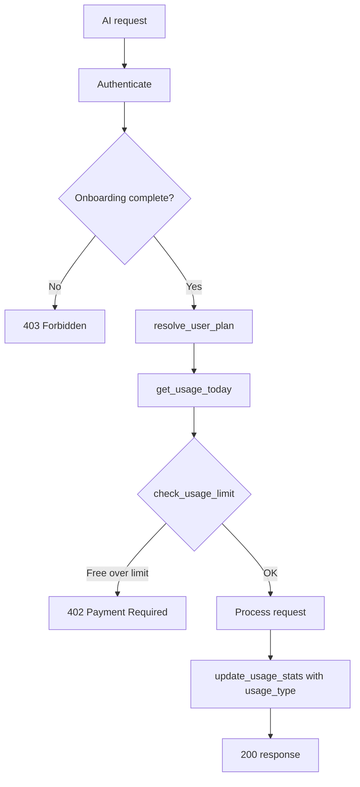

# Subscription System Implementation

This document describes the subscription system for the AI English Practice backend: plans, usage limits, APIs, and how AI endpoints are protected.

## Overview

The application supports three plans:

| Plan     | Description                | Usage limits                    |
|----------|----------------------------|----------------------------------|
| **free** | Limited daily usage        | 5 AI chats/day, 1 voice/day     |
| **trial**| Full access for 3 days     | Unlimited                       |
| **premium** | Unlimited access       | Unlimited                       |

### Pricing (reference)

- **Trial:** ₹3 for 3 days  
- **Premium:** ₹199 per month  

---

## Plan Resolution

The effective plan is **resolved dynamically** from the user record and current time (no cron job).

- **`resolve_user_plan(user)`** (in `app/services/subscription_service.py`):
  1. If `subscription_expires_at` is set and in the future → **premium**
  2. Else if `trial_expires_at` is set and in the future → **trial**
  3. Else → **free**

Expired trial or premium automatically behaves as **free** on the next request.

---

## User Model Fields

In `app/models/user.py`:

| Field                    | Type     | Description                          |
|--------------------------|----------|--------------------------------------|
| `plan`                   | String   | Stored plan: free / trial / premium |
| `trial_expires_at`       | DateTime | Trial end (null if not on trial)    |
| `subscription_expires_at`| DateTime | Premium end (null if not premium)    |
| `is_trial_used`          | Boolean  | Prevents multiple trials             |

---

## Usage Table and Limits

The existing **Usage** table is extended with:

- **`chat_count`** — incremented for each text-chat and chat/stream request.
- **`voice_count`** — incremented for each voice-chat and voice-chat/stream request.

`request_count` and `minutes_used` are still updated for backward compatibility.

### How limits are enforced

- **Free:** Before each AI request, `check_usage_limit(user, usage_today)` runs. If `chat_count >= 5` or `voice_count >= 1`, the server returns **402 Payment Required** with body:
  ```json
  {
    "error": "subscription_required",
    "message": "Upgrade to continue unlimited practice"
  }
  ```
- **Trial / Premium:** No limit check; request proceeds.

### Which endpoints count as chat vs voice

| Endpoint             | Type   | Incremented after success |
|----------------------|--------|----------------------------|
| `POST /api/v1/ai/text-chat`      | chat  | `chat_count`               |
| `POST /api/v1/ai/voice-chat`     | voice | `voice_count`              |
| `POST /api/v1/ai/chat/stream`    | chat  | `chat_count`               |
| `POST /api/v1/ai/voice-chat/stream` | voice | `voice_count`          |
| `POST /api/v1/ai/tts/stream`     | —     | No increment (plan still checked) |
| `POST /api/v1/ai/init-models`    | —     | No increment (plan still checked) |

---

## Subscription API

Base path: **`/api/v1/subscription`**

### GET /api/v1/subscription/status

Returns the current resolved plan, expiration dates, and **today's usage with limits**.

**Response (200):**
```json
{
  "plan": "free",
  "trial_expires_at": null,
  "subscription_expires_at": null,
  "usage": {
    "date": "2026-03-10",
    "chat_count": 3,
    "voice_count": 0,
    "chat_limit": 5,
    "voice_limit": 1,
    "minutes_used": 2.5
  }
}
```

For **trial** or **premium** plans, `chat_limit` and `voice_limit` are `null` (unlimited). Example:
```json
{
  "plan": "trial",
  "trial_expires_at": "2026-06-20T12:00:00",
  "subscription_expires_at": null,
  "usage": {
    "date": "2026-03-10",
    "chat_count": 10,
    "voice_count": 5,
    "chat_limit": null,
    "voice_limit": null,
    "minutes_used": 15.0
  }
}
```

Requires authentication (Bearer token). One database query (today's Usage row) is used to build the response.

---

## Usage and stats

GET `/api/v1/subscription/status` includes an **`usage`** object so users can see their current usage and limits in one call.

### Usage object fields

| Field         | Type    | Description |
|---------------|---------|-------------|
| `date`        | string  | ISO date (e.g. `"2026-03-10"`) for which usage applies |
| `chat_count` | int     | Number of AI chats used today |
| `voice_count`| int     | Number of voice conversations used today |
| `chat_limit` | int \| null | Max chats per day; `null` = unlimited (trial/premium) |
| `voice_limit`| int \| null | Max voice per day; `null` = unlimited (trial/premium) |
| `minutes_used` | float | Total minutes of usage today |

### Client display

- **Free plan:** Show e.g. "3/5 chats today", "0/1 voice", "2.5 min used". When `chat_count >= chat_limit` or `voice_count >= voice_limit`, show upgrade prompt (and the API will return 402 on the next AI request).
- **Trial / Premium:** When `chat_limit` and `voice_limit` are `null`, show "Unlimited" or hide limit UI; still show `chat_count`, `voice_count`, and `minutes_used` if you want activity stats.

The status endpoint uses a single query (`get_usage_today_for_display`) to load today's Usage row; limits are derived from the resolved plan (constants `FREE_MAX_CHATS_PER_DAY`, `FREE_MAX_VOICE_PER_DAY` in the subscription service). For historical stats (e.g. last 7 days), a separate endpoint such as GET `/api/v1/subscription/usage/history` could be added later with date range and pagination.

---

### POST /api/v1/subscription/start-trial

Activates the 3-day trial after payment verification.

**Request body:**
```json
{
  "payment_verified": true
}
```

**Logic:**
- If `payment_verified` is not true → **400**
- If `user.is_trial_used` is true → **400** "Trial already used"
- Otherwise: set `plan = "trial"`, `trial_expires_at = now + 3 days`, `is_trial_used = true`; commit; log `trial_started`.

**Response (200):** `{"message": "Trial started", "plan": "trial"}`

---

### POST /api/v1/subscription/activate-premium

Activates premium after Google Play / Apple purchase (verification is placeholder).

**Request body:**
```json
{
  "purchase_token": "token_from_store",
  "provider": "google"
}
```

**Logic:** Placeholder verification; set `plan = "premium"`, `subscription_expires_at = now + 30 days`; commit; log `premium_activated`.

**Response (200):** `{"message": "Premium activated", "plan": "premium"}`

---

## Protected AI Endpoints

All AI endpoints under `/api/v1/ai/` that perform chat or voice usage:

1. Require authentication and onboarding (existing behavior).
2. Use the **`require_active_plan`** dependency, which:
   - Resolves plan via `resolve_user_plan(user)`
   - Loads today’s usage via `get_usage_today(user_id, db)`
   - Calls `check_usage_limit(user, usage_today)` → raises **402** if free user is over limit
3. After a successful request, call **`update_usage_stats(user_id, db, duration_seconds, usage_type="chat"|"voice")`** so that `chat_count` or `voice_count` is incremented.

---

## Auth Responses Including Plan

### GET /api/v1/auth/me

Response includes resolved plan and expiration dates:

```json
{
  "id": "...",
  "email": "...",
  "name": "...",
  "plan": "free",
  "trial_expires_at": null,
  "subscription_expires_at": null,
  "onboarding_completed": true,
  "onboarding_step": 5
}
```

`plan` is always the **resolved** plan (e.g. expired trial → `"free"`).

### POST /api/v1/auth/oauth

The nested `user` object in the token response includes the same plan fields:

```json
{
  "access_token": "...",
  "refresh_token": "...",
  "token_type": "bearer",
  "user": {
    "id": "...",
    "email": "...",
    "plan": "free",
    "trial_expires_at": null,
    "subscription_expires_at": null,
    "onboarding_completed": true,
    "onboarding_step": 5
  }
}
```

---

## Security Rules

- **Trial once:** `is_trial_used` is set when trial starts; `POST /subscription/start-trial` returns 400 if already used.
- **Expired → free:** Handled entirely in `resolve_user_plan`; no background job required.
- **Plan is always resolved:** All responses use `resolve_user_plan(user)` so the client never sees a stale plan.
- **402 body:** Custom exception handler in `app/main.py` ensures 402 responses return `{"error": "subscription_required", "message": "..."}` at the top level.

---

## Plan Resolution and Limit Check Flow



---

## Files Reference

| Component            | File |
|----------------------|------|
| User subscription fields | `app/models/user.py` |
| Usage chat/voice counts   | `app/models/usage.py` |
| Subscription logic       | `app/services/subscription_service.py` (`resolve_user_plan`, `get_usage_today`, `get_usage_today_for_display`, `check_usage_limit`, `update_usage_stats`) |
| Subscription API         | `app/api/subscription.py` |
| Subscription schemas     | `app/schemas/subscription.py` (`SubscriptionStatusResponse`, `UsageTodayResponse`, etc.) |
| Plan guard dependency    | `app/dependencies/subscription.py` |
| AI endpoint protection   | `app/api/ai.py` (uses `require_active_plan`, `update_usage_stats(..., usage_type)`) |
| Auth with plan in response | `app/schemas/auth.py`, `app/api/auth.py` |
| 402 exception handler    | `app/main.py` |
| Migration                | `alembic/versions/b7c8d9e0f1a2_add_subscription_fields.py` |
